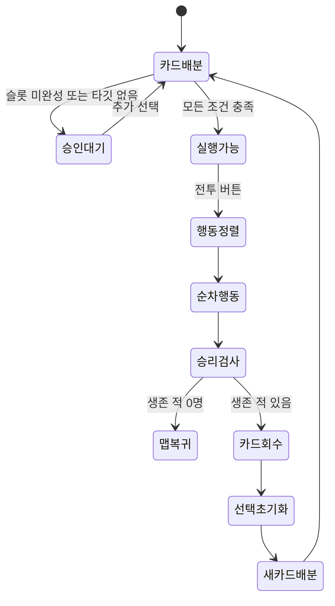

# 구현 현황

## 검증 기준

- 확인일: 2026-09-27
- Unity 기능 변경 기준: `main` / `3432939` (`흠터`) + 현재 미커밋 작업 트리
- Unity 버전: `6000.3.11f1`
- 확인 방식: Unity 코드, 씬 YAML, 프리팹 및 ScriptableObject 정적 대조
- 실행 검증: 미실시 — Unity 영역 Read Only 원칙에 따라 프로젝트를 실행하지 않음
- Build Settings: `Map_1F.unity`, `Playing_Scene.unity` 활성화
- 미커밋 Unity 변경 확인: 승리 판정, 전투→맵 비동기 복귀, 현재 노드 ID 복원, 맵 진입 페이드, 적 프리팹 HP `1`, TMP 폰트 Asset 변경. 읽기만 했으며 수정하지 않음

## 기능 매트릭스

| 영역 | 기능 | 상태 | 근거 |
|---|---|---:|---|
| 카드 | 진입 페이드 완료 후 총 6장 배분, 숫자 카드와 선택적 특수 카드 `T` 생성 | 🟢 구현 | `CardSpawner.Start()`와 씬 직렬화 값 |
| 카드 | 카드 호버·선택·소유 슬롯 제어 | 🟢 구현 | `Card`, 선택 매니저 3종 |
| Front | 카드 1장 + 공격/방어 선택 | 🟢 구현 | `FrontCardSelectionManager` |
| Middle | 속성/특수 카드 + 숫자 2장 + 물리/마법 모드 | 🟢 구현 | `MiddleCardSelectionManager` |
| Back | 일반 카드 2장으로 행동 승인 | 🟢 구현 | `BackCardSelectionManager` |
| 전투 | 모든 포지션·타깃 조건 통합 승인 | 🟢 구현 | `BattleAccessManager` |
| 전투 | 속도 기반 아군·적 행동 정렬 | 🟢 구현 | `BattleExecuteManager` |
| 전투 | 각 행동 후 생존 적 0명 판정과 승리 처리 | 🟢 구현 | `AreAllEnemiesDefeated()` → `ReturnToMap()` |
| 전투 | 아군 전멸·패배 판정 | 🔴 미구현 | 패배 검사와 결과 처리 없음 |
| 전투 | 물리/마법 피해와 방어 계산 | 🟢 구현 | `Operator`, `Enemy` |
| 전투 | Front 임시 공격/방어 보너스 | 🟢 구현 | `ApplyBattleBonus` |
| 전투 | Back 자동 회복 대상 선정 | 🟢 구현 | `AllyTargetingManager` |
| 적 | 4개 위치 스폰 포인트와 생성 | 🟢 구현 | `EnemySpawnManager` |
| UI | 대원 클릭 포커스, 감속, 정보 패널 | 🟢 구현 | `OperatorFocusManager` |
| 맵 | 8노드 연결 그래프와 현재 위치 | 🟢 구현 | `MapNode`, `MapPlayerPositionFeedback` |
| 맵 | 궤도 카메라, 노드 포커스, 선택지 UI | 🟢 구현 | `MapOrbitCamera`, `MapNodeFocusObject` |
| 입력/UI | 선택지 EventSystem 포인터 처리와 맵 클릭 차단 | 🟢 구현 | `MapChoiceButton`, `MapChoiceHoverEffect`, `MapNodeClickHandler` |
| 씬 전환 | Battle 노드 선택 후 `Playing_Scene` 비동기 로드와 양쪽 페이드 | 🟢 구현 | `MapChoice`, `MapBattleSceneLoader`, `BattleSceneFadeIn`과 씬 참조 |
| 씬 전환 | 승리 후 `Map_1F` 비동기 복귀와 맵 진입 페이드 | 🟢 구현 | `BattleToMapSceneLoader`, `MapSceneFadeIn`과 씬 참조 |
| 맵 | 복귀 시 마지막 현재 노드 ID 복원 | 🟢 구현 | `MapRunState`, `MapPlayerPositionFeedback` |
| 로딩 UI | 맵 퇴장/전투 진입 CanvasGroup, 문구와 점 애니메이션 | 🟢 구현 | 양쪽 CanvasGroup·TMP 참조 연결 |
| 로딩 이미지 | 전환 화면의 최종 배경 이미지와 미술 연출 | 🟡 부분 구현 | 양쪽 배경 Image의 Sprite 미지정, 검은색 임시 화면 |
| 스킬 | 데이터·SP 충전 모델 | 🟡 부분 구현 | 전투 호출 경로 없음 |
| 속성 | 5개 속성 분류와 UI | 🟡 부분 구현 | 계산 결과가 현재 대부분 동일 |
| 이벤트 | 선택 문구 표시 | 🟡 부분 구현 | 선택별 결과 분기 없음 |
| 게임 흐름 | `Map_1F` → 전투 → 승리 → 현재 노드로 복귀 | 🟢 구현 | 현재 작업 트리의 코드·씬 호출 경로 연결 |
| 게임 흐름 | `Title` → `Map_1F` | 🔴 미구현 | 진입 라우터와 Build Settings 등록 없음 |
| 실행 검증 | 양방향 전환·입력 차단·복귀 위치 | 🟡 확인 필요 | Read Only 정책으로 Unity 실행 미실시 |
| 런 상태 | 현재 노드 ID 유지 | 🟡 부분 구현 | 정적 메모리 상태만 존재, `Reset()` 호출처 없음 |
| 저장 | 런 진행/세이브 | 🔴 미구현 | 디스크 영속화 계층 확인되지 않음 |

상태 판정과 Obsidian 표시법은 [[00 프로젝트/상태 표기 규칙|상태 표기 규칙]]을 따른다.

## 현재 완성된 전투 루프

## 다음 통합 이정표

1. 맵→전투→승리→맵 복귀의 실제 플레이 검증
2. 패배 판정과 패배 결과 처리
3. 현재 노드 외의 전투 결과·완료 노드를 보존하는 런 컨텍스트
4. 최종 로딩 이미지 연결과 화면 비율 조정
5. Shop/Event 노드 실행기
6. 카드 숫자가 Back 회복량에 반영되는 공식 확정
7. 속성별 차별화된 피해/상태 효과
8. `OperatorSkill`을 행동 루프에 연결
