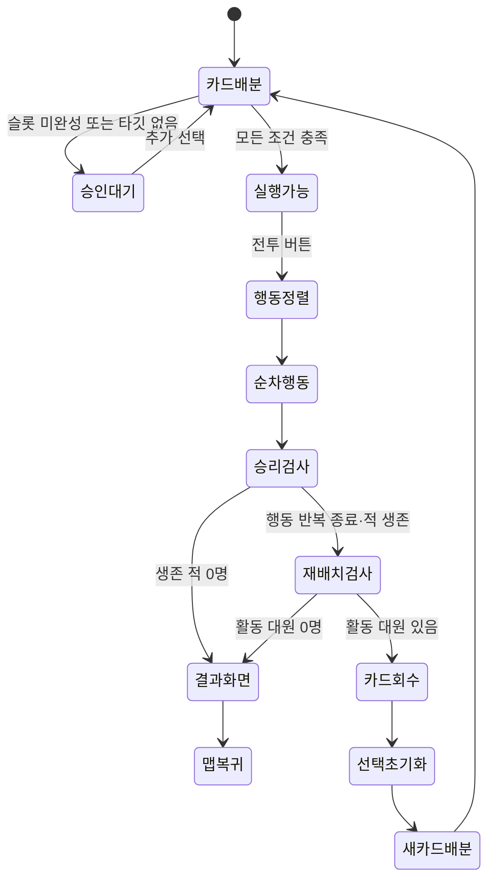

# 구현 현황

## 검증 기준

- 확인일: 2026-10-02
- 점검 기준: `OnlyAI` / `acf7c46` (`JSON파일로 정리함`)
- 재점검 시 작업 트리: 이전 Wiki 갱신과 신규 `04 기획` 문서가 미커밋 상태다. Unity 영역(`Assets`·`Packages`·`ProjectSettings`)의 변경은 없다. 원격 서버 재조회는 하지 않음.
- 보존된 플래그: [[03 개발 기록/2026-10-02 현재 상태 기준점|RSR-2026-10-02-01]] (`8285557` 당시 기록, 이번 갱신에서 수정하지 않음)
- Unity 버전: `6000.3.11f1`
- 확인 방식: Unity 코드, 씬 YAML, 프리팹 및 ScriptableObject 정적 대조
- 실행 검증: 미실시 — Unity 영역 Read Only 원칙에 따라 프로젝트를 실행하지 않음
- Build Settings: `Map_1F.unity`, `Playing_Scene.unity` 활성화
- 후속 구현: 패배·결과 화면·퇴각·재배치 기반, JSON 문구/기본 정의 이전, 데이터 검증 메뉴와 테스트 코드 추가
- Unity 테스트 코드의 존재는 확인했으나 Test Runner·컴파일·빌드·실제 플레이 통과 여부는 미확인

## 이번 재점검의 진행사항

- 코드 기준은 이전과 같은 `acf7c46`이다. 새 구현 완료나 QA 통과로 변경할 근거는 확인되지 않았다.
- [[04 기획/타이틀·로비 기획|타이틀·로비 기획]]과 4개 파트 문서가 추가되어 사용자 요구·검토 제안·미결정 정책을 분리했다.
- 기록된 방향: Title→XP 느낌의 로비, 설정·폴더 이어하기·문서형 새 게임 `.exe`, TMP/Square 임시 UI, Map `− / □ / ×`, Battle `나가기 / 계속하기`.
- 기획 문서 작성은 완료되었으나 로비·창 모드·일시정지·저장 기능은 아직 미구현이다. 현재 `Title` 씬은 `Main Camera`만 있고 Build Settings에는 Map/전투만 등록되어 있다.
- 최소화·나가기의 목적지, 저장 범위와 실패 처리, Battle 중단 가능 시점·시간 배율 복원·재진입 기준은 미결정이다. AI 제안을 확정 정책으로 적용하지 않는다.
- 일반 라운드 보너스 초기화 누락과 Unity 실행 검증 미완료는 그대로 유지한다. 고정 플래그 문서는 수정하지 않았다.

## 기능 매트릭스

| 영역 | 기능 | 상태 | 근거 |
|---|---|---:|---|
| 카드 | 진입 페이드 완료 후 총 6장 배분, 숫자 카드와 선택적 특수 카드 `T` 생성 | 🟢 구현 | `CardSpawner.Start()`와 씬 직렬화 값 |
| 카드 | 카드 호버·선택·소유 슬롯 제어 | 🟢 구현 | `Card`, 선택 매니저 3종 |
| Front | 카드 1장 + 공격/방어 선택 | 🟢 구현 | `FrontCardSelectionManager` |
| Middle | 속성/특수 카드 + 숫자 2장 + 물리/마법 모드 | 🟢 구현 | `MiddleCardSelectionManager` |
| Back | 일반 카드 2장으로 행동 승인 | 🟢 구현 | `BackCardSelectionManager` |
| 전투 | 모든 포지션·타깃 조건 통합 승인 | 🟢 구현 | `BattleAccessManager` |
| 전투 | 속도 기반 아군·적 행동 정렬 | 🟢 구현 | `BattleExecuteManager` |
| 전투 | 각 행동 후 생존 적 0명 판정과 승리 처리 | 🟢 구현 | `AreAllEnemiesDefeated()` → `FinishBattle(Success)` → 결과 화면 → 맵 복귀 |
| 전투 | 활동 가능한 대원 0명 패배 판정 | 🟢 구현 | 재배치 턴 처리 후 `FinishBattle(Failure)`; 새 카드 배분 전 종료 |
| 전투 | 일반 라운드 임시 보너스 초기화 | 🟡 수정 필요 | `ResetOperatorBonuses()`가 종료 분기에만 호출됨 |
| 전투 | 성공/실패 결과 화면 | 🟢 구현 | `BattleResultPresenter`의 씬 참조와 JSON 문구 키 연결 |
| 대원 | HP 0 시 퇴각·행동/대상 제외 | 🟢 구현 | `IsCombatActive`, `Retreat`, 승인 조건·클릭·포커스 처리 |
| 대원 | 부활·예약 재배치 | 🟡 부분 구현 | API·이벤트·턴 처리 존재, 실제 발동 수단 미연결 |
| 데이터 | JSON 문구·대원/적/스킬 기본 정의 | 🟢 구현 | manifest·`GameDataCatalog`·키/ID의 씬/Asset 연결 |
| 검증 | 데이터 검증 메뉴·빌드 전 검사·테스트 코드 | 🟡 실행 미확인 | 코드 추가 확인, Unity 검증 실행은 미실시 |
| 전투 | 물리/마법 피해와 방어 계산 | 🟢 구현 | `Operator`, `Enemy` |
| 전투 | Front 임시 공격/방어 보너스 | 🟢 구현 | `ApplyBattleBonus` |
| 전투 | Back 자동 회복 대상 선정 | 🟢 구현 | `AllyTargetingManager` |
| 적 | 4개 위치 스폰 포인트와 생성 | 🟢 구현 | `EnemySpawnManager` |
| UI | 대원 클릭 포커스, 감속, 정보 패널 | 🟢 구현 | `OperatorFocusManager` |
| 맵 | 8노드 연결 그래프와 현재 위치 | 🟢 구현 | `MapNode`, `MapPlayerPositionFeedback` |
| 맵 | 궤도 카메라, 노드 포커스, 선택지 UI | 🟢 구현 | `MapOrbitCamera`, `MapNodeFocusObject` |
| 입력/UI | 선택지 EventSystem 포인터 처리와 맵 클릭 차단 | 🟢 구현 | `MapChoiceButton`, `MapChoiceHoverEffect`, `MapNodeClickHandler` |
| 씬 전환 | Battle 노드 선택 후 `Playing_Scene` 비동기 로드와 양쪽 페이드 | 🟢 구현 | `MapChoice`, `MapBattleSceneLoader`, `BattleSceneFadeIn`과 씬 참조 |
| 씬 전환 | 성공·실패 후 `Map_1F` 비동기 복귀와 맵 진입 페이드 | 🟢 구현 | `BattleToMapSceneLoader`, `MapSceneFadeIn`과 씬 참조 |
| 맵 | 복귀 시 마지막 현재 노드 ID 복원 | 🟢 구현 | `MapRunState`, `MapPlayerPositionFeedback` |
| 로딩 UI | 맵 퇴장/전투 진입 CanvasGroup, 문구와 점 애니메이션 | 🟢 구현 | 양쪽 CanvasGroup·TMP 참조 연결 |
| 로딩 이미지 | 전환 화면의 최종 배경 이미지와 미술 연출 | 🟡 부분 구현 | 양쪽 배경 Image의 Sprite 미지정, 검은색 임시 화면 |
| 스킬 | 데이터·SP 충전 모델 | 🟡 부분 구현 | 전투 호출 경로 없음 |
| 속성 | 5개 속성 분류와 UI | 🟡 부분 구현 | 계산 결과가 현재 대부분 동일 |
| 이벤트 | 선택 문구 표시 | 🟡 부분 구현 | 선택별 결과 분기 없음 |
| 게임 흐름 | `Map_1F` → 전투 → 성공/실패 결과 → 현재 노드로 복귀 | 🟢 구현 | 현재 작업 트리의 코드·씬 호출 경로 연결 |
| 게임 흐름 | `Title` → `Map_1F` | 🔴 미구현 | 진입 라우터와 Build Settings 등록 없음 |
| 로비 | Title→XP 스타일 로비·설정·새 게임·이어하기 | 🔴 미구현 | 사용자 방향을 기획으로 기록, 실행 UI/라우터 없음 |
| 맵 UI | 창 모드 연출·최소화·확대·저장 후 나가기 | 🔴 미구현 | 기획 기록만 있음, 목적지·보존·입력 정책 미결정 |
| 전투 UI | 일시정지 창·나가기·계속하기 | 🔴 미구현 | 기획 기록만 있음, 중단·복원·재진입 정책 미결정 |
| 실행 검증 | 양방향 전환·입력 차단·복귀 위치 | 🟡 확인 필요 | Read Only 정책으로 Unity 실행 미실시 |
| 런 상태 | 현재 노드 ID·표시명 유지 | 🟡 부분 구현 | 정적 메모리 상태만 존재, `Reset()` 호출처 없음 |
| 저장 | 런 진행/세이브 | 🔴 미구현 | 디스크 영속화 계층 확인되지 않음 |

상태 판정과 Obsidian 표시법은 [[00 프로젝트/상태 표기 규칙|상태 표기 규칙]]을 따른다.

## 현재 완성된 전투 루프

## 다음 통합 이정표

1. 일반 라운드 임시 보너스 초기화 복구
2. JSON 검증 메뉴·Test Runner 실행과 성공/실패·퇴각·맵 왕복 플레이 검증
3. 현재 노드 외의 전투 결과·완료 노드를 보존하는 런 컨텍스트
4. 최종 로딩 이미지 연결과 화면 비율 조정
5. Shop/Event 노드 실행기
6. 카드 숫자가 Back 회복량에 반영되는 공식 확정
7. 속성별 차별화된 피해/상태 효과
8. `OperatorSkill`을 행동 루프에 연결
9. 로비·Map 창 모드·Battle 일시정지의 미결정 정책 확정 후 UI·라우팅·저장 연결. 상세 요구는 [[04 기획/타이틀·로비 기획|파트별 기획]]을 따른다.
