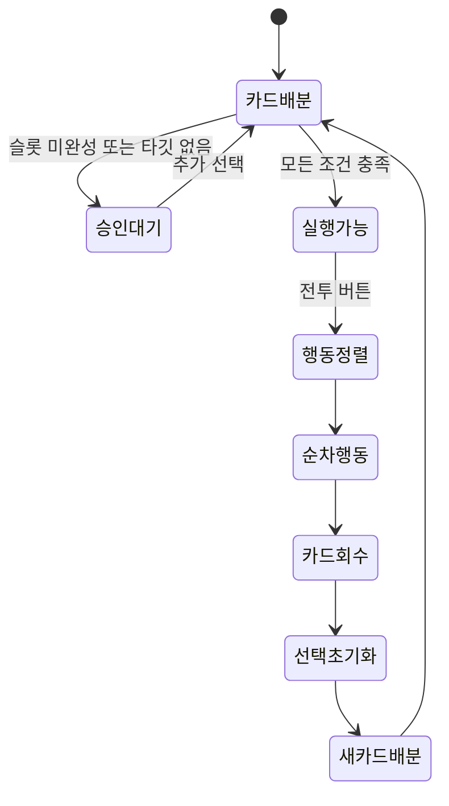

# 구현 현황

## 검증 기준

- 확인일: 2026-09-22
- 기준 브랜치·커밋: `main` / `8d95d14`
- Unity 버전: `6000.3.11f1`
- 확인 방식: Unity 코드, 씬 YAML, 프리팹 및 ScriptableObject 정적 대조
- 실행 검증: 미실시 — Unity 영역 Read Only 원칙에 따라 프로젝트를 실행하지 않음
- Build Settings: `Playing_Scene.unity`만 활성화

## 기능 매트릭스

| 영역 | 기능 | 상태 | 근거 |
|---|---|---:|---|
| 카드 | 총 6장 배분, 숫자 카드와 선택적 특수 카드 `T` 생성 | 🟢 구현 | `Playing_Scene`의 `CardSpawner` 직렬화 값 |
| 카드 | 카드 호버·선택·소유 슬롯 제어 | 🟢 구현 | `Card`, 선택 매니저 3종 |
| Front | 카드 1장 + 공격/방어 선택 | 🟢 구현 | `FrontCardSelectionManager` |
| Middle | 속성/특수 카드 + 숫자 2장 + 물리/마법 모드 | 🟢 구현 | `MiddleCardSelectionManager` |
| Back | 일반 카드 2장으로 행동 승인 | 🟢 구현 | `BackCardSelectionManager` |
| 전투 | 모든 포지션·타깃 조건 통합 승인 | 🟢 구현 | `BattleAccessManager` |
| 전투 | 속도 기반 아군·적 행동 정렬 | 🟢 구현 | `BattleExecuteManager` |
| 전투 | 물리/마법 피해와 방어 계산 | 🟢 구현 | `Operator`, `Enemy` |
| 전투 | Front 임시 공격/방어 보너스 | 🟢 구현 | `ApplyBattleBonus` |
| 전투 | Back 자동 회복 대상 선정 | 🟢 구현 | `AllyTargetingManager` |
| 적 | 4개 위치 스폰 포인트와 생성 | 🟢 구현 | `EnemySpawnManager` |
| UI | 대원 클릭 포커스, 감속, 정보 패널 | 🟢 구현 | `OperatorFocusManager` |
| 맵 | 8노드 연결 그래프와 현재 위치 | 🟢 구현 | `MapNode`, `MapPlayerPositionFeedback` |
| 맵 | 궤도 카메라, 노드 포커스, 선택지 UI | 🟢 구현 | `MapOrbitCamera`, `MapNodeFocusObject` |
| 스킬 | 데이터·SP 충전 모델 | 🟡 부분 구현 | 전투 호출 경로 없음 |
| 속성 | 5개 속성 분류와 UI | 🟡 부분 구현 | 계산 결과가 현재 대부분 동일 |
| 이벤트 | 선택 문구 표시 | 🟡 부분 구현 | 선택별 결과 분기 없음 |
| 게임 흐름 | 타이틀·맵·전투 간 전환 | 🔴 미구현 | 전환 코드 확인되지 않음 |
| 저장 | 런 진행/세이브 | 🔴 미구현 | 저장 계층 확인되지 않음 |

상태 판정과 Obsidian 표시법은 [[00 프로젝트/상태 표기 규칙|상태 표기 규칙]]을 따른다.

## 현재 완성된 전투 루프

## 다음 통합 이정표

1. 맵 노드 종류에 따라 전투·상점·이벤트 씬을 여는 라우터
2. 전투 결과를 맵 진행 상태로 반환하는 런 컨텍스트
3. 카드 숫자가 Back 회복량에 반영되는 공식 확정
4. 속성별 차별화된 피해/상태 효과
5. `OperatorSkill`을 행동 루프에 연결
6. 승리·패배 판정과 다음 라운드/노드 전환
