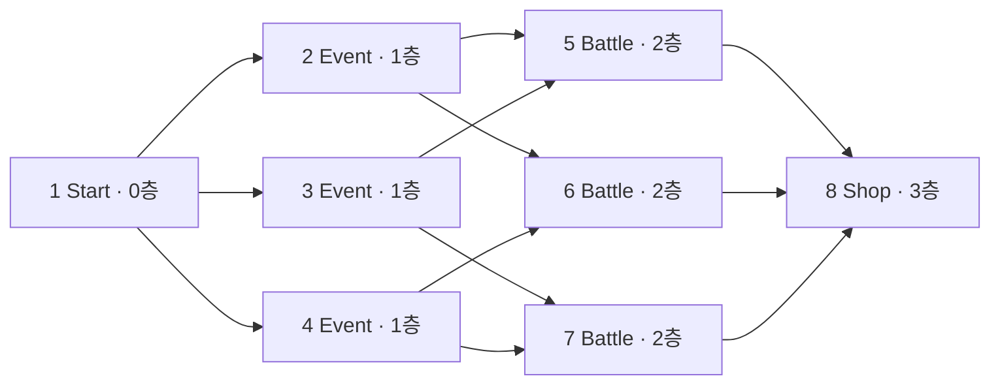

# 맵 시스템

> [!implemented] 🟢 구현
> 노드 연결, 현재 위치, 이동 가능 판정, 카메라 포커스와 선택지 UI가 연결되어 있다.

## 노드 모델

각 `MapNode`는 ID, 층, 노드 종류, 연결 노드, 설명, 선택지, 시각 상태를 가진다.

노드 종류는 `Start`, `Battle`, `EliteBattle`, `Event`, `Shop`, `Rest`, `FirstBoss`, `SecondBoss`, `ThridBoss`, `Boss`로 정의되어 있다. 현재 씬에서는 Start, Event, Battle, Shop만 사용한다.

시각 상태는 다음 네 가지다.

- `Normal`: 기본
- `Current`: 현재 위치
- `Unavailable`: 이미 지나간 층 등 접근 불가
- `ReachablePreview`: 현재 노드에서 이동 가능한 연결 노드

## 현재 경로

## 상호작용 흐름

1. 마우스 드래그는 궤도 카메라를 회전하고 맵 오브젝트에 관성을 전달한다.
2. 드래그 임계값 이하의 클릭만 노드 클릭으로 인정한다.
3. 노드를 클릭하면 카메라가 해당 노드로 부드럽게 이동한다.
4. 설명 패널과, 이동 가능한 노드인 경우 선택지 패널이 양쪽에서 들어온다.
5. 선택지를 누르면 `MapChoice.Select(focusedNode)`가 현재 위치를 포커스한 노드로 이동시킨다.
6. ESC 또는 같은 노드 재클릭으로 포커스를 취소하고 원래 카메라 위치로 돌아간다.

## 이동 규칙

- 현재 노드의 `ConnectedNodes`에 포함된 노드만 이동 가능
- `IsUnavailable` 노드는 이동 불가
- 새 노드로 이동하면 더 낮은 층의 모든 노드를 접근 불가로 전환
- 현재 노드에 마우스를 올리면 이동 가능한 다음 노드를 초록색으로 미리 표시
- 선택지 패널도 현재 노드에서 연결된 다음 노드에 대해서만 열린다

## 현재 선택지의 의미

이벤트 노드에는 “다가간다”, “무시한다”, “경계한다” 같은 문구가 있으나 모든 선택지는 동일한 `MoveToNode(focusedNode)`를 호출한다. 즉, 현재는 선택 문구가 결과를 분기하지 않으며 노드 진입 확인 UI 역할만 한다.

## 제한 사항

- 노드 종류에 따른 씬 전환 또는 이벤트 실행 없음
- 상점 기능과 전투 진입 기능 미연결
- 런 상태 영속화 없음
- enum의 `ThridBoss`는 `ThirdBoss`의 오타로 보임
