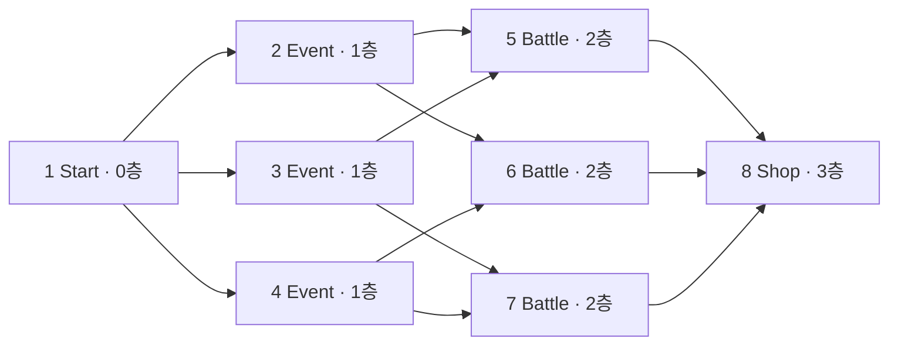

# 맵 시스템

> [!implemented] 🟢 구현
> 노드 연결, 현재 위치, 이동 가능 판정, 카메라 포커스와 선택지 UI가 연결되어 있다.

## 노드 모델

각 `MapNode`는 ID, 층, 노드 종류, 연결 노드, 설명, 선택지, 시각 상태를 가진다.

노드 종류는 `Start`, `Battle`, `EliteBattle`, `Event`, `Shop`, `Rest`, `FirstBoss`, `SecondBoss`, `ThridBoss`, `Boss`로 정의되어 있다. 현재 씬에서는 Start, Event, Battle, Shop만 사용한다.

시각 상태는 다음 네 가지다.

- `Normal`: 기본
- `Current`: 현재 위치
- `Unavailable`: 이미 지나간 층 등 접근 불가
- `ReachablePreview`: 현재 노드에서 이동 가능한 연결 노드

## 현재 경로

## 상호작용 흐름

1. 마우스 드래그는 궤도 카메라를 회전하고 맵 오브젝트에 관성을 전달한다.
2. 드래그 임계값 이하의 클릭만 노드 클릭으로 인정한다.
3. 노드를 클릭하면 카메라가 해당 노드로 부드럽게 이동한다.
4. 설명 패널과, 이동 가능한 노드인 경우 선택지 패널이 양쪽에서 들어온다.
5. 선택지를 누르면 `MapChoice.Select(focusedNode)`가 현재 위치를 포커스한 노드로 이동시킨다.
6. 이동에 성공한 노드가 Battle 타입이면 `MapBattleSceneLoader.LoadBattle()`을 호출한다.
7. ESC 또는 같은 노드 재클릭으로 포커스를 취소하고 원래 카메라 위치로 돌아간다.

선택지 UI는 직접 마우스 좌표를 검사하는 방식에서 EventSystem의 `IPointerClickHandler`, `IPointerEnterHandler`, `IPointerExitHandler` 방식으로 변경되었다. 선택지 위에서 클릭할 때 뒤쪽의 3D 맵 노드가 함께 눌리지 않도록 `MapNodeClickHandler`도 UI 위 입력을 무시한다.

## 이동 규칙

- 현재 노드의 `ConnectedNodes`에 포함된 노드만 이동 가능
- `IsUnavailable` 노드는 이동 불가
- 새 노드로 이동하면 더 낮은 층의 모든 노드를 접근 불가로 전환
- 현재 노드에 마우스를 올리면 이동 가능한 다음 노드를 초록색으로 미리 표시
- 선택지 패널도 현재 노드에서 연결된 다음 노드에 대해서만 열린다

## 현재 선택지의 의미

이벤트 노드에는 “다가간다”, “무시한다”, “경계한다” 같은 문구가 있으나 모든 선택지는 동일한 `MoveToNode(focusedNode)`를 호출한다. 즉, Event 선택 문구는 아직 결과를 분기하지 않는다. Battle 타입 노드는 이동 성공 후 전투 씬 로더를 추가로 호출한다.

## 전투 노드 연결

Battle 노드 진입과 승리 후 복귀의 비동기 로딩 흐름은 [[01 시스템/씬 전환 및 로딩|씬 전환 및 로딩]]에서 관리한다. 맵 퇴장 페이드, 전투 진입, 모든 적 처치 후 맵 복귀, 현재 노드 복원은 코드·씬 참조상 🟢 구현되어 있다. 실제 플레이 검증과 최종 로딩 이미지는 🟡 항목이다.

## 복귀 위치 보존

- `MapPlayerPositionFeedback.SetCurrentNode()`는 이동할 때마다 노드 ID를 `MapRunState.SaveCurrentNode()`에 저장한다.
- `Map_1F`을 다시 열면 저장된 ID와 같은 씬의 `MapNode`를 찾아 현재 노드로 복원한다.
- 저장된 ID가 없거나 일치하는 노드가 없으면 씬의 `startNode`를 사용한다.
- `MapRunState`는 정적 메모리 상태이므로 디스크 세이브가 아니며 `Reset()` 호출처도 현재 확인되지 않는다.

## 제한 사항

- Battle 이외의 Shop/Event 노드 실행기 없음
- 승리 외 전투 결과를 맵에 반영하는 모델 없음
- 현재 노드 외 완료 노드·보상·런 데이터 없음
- 런 상태 디스크 영속화 없음
- enum의 `ThridBoss`는 `ThirdBoss`의 오타로 보임
