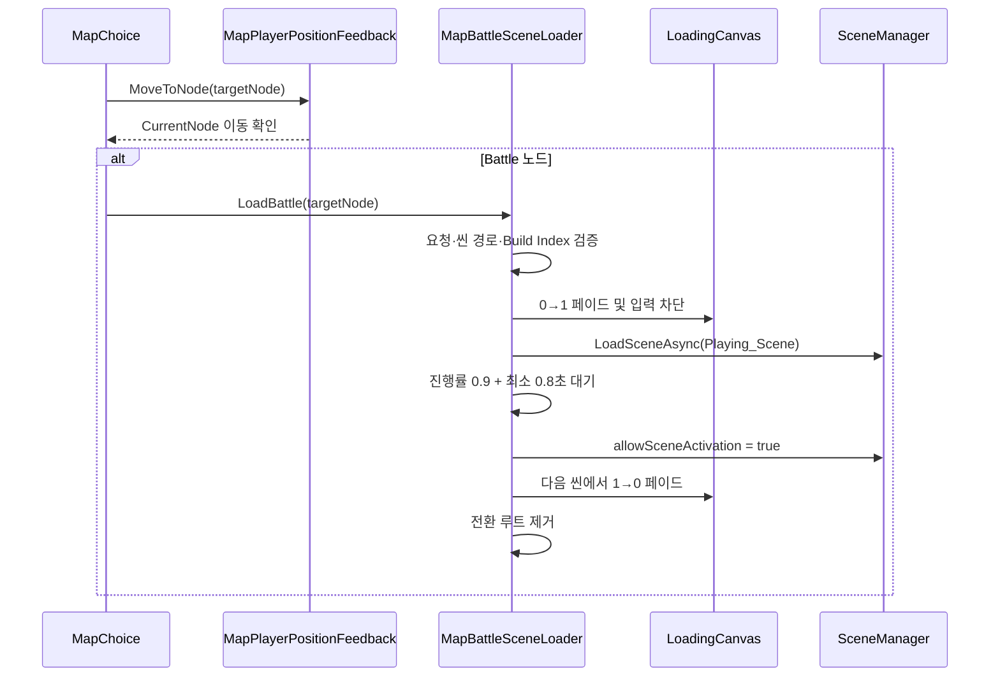

# 씬 전환 및 로딩

> [!partial] 🟡 부분 구현
> Battle 노드에서 전투 씬을 비동기로 불러오는 코드와 로딩 오버레이는 연결되었다. 로딩 배경 이미지는 아직 지정되지 않았으며 실제 실행 검증과 전투 후 맵 복귀가 남아 있다.

## 현재 구조

별도의 Loading 씬을 거치는 방식이 아니라 `Map_1F`의 `MapLoader_BattleScene` 루트에 있는 `LoadingCanvas`를 씬 전환 동안 유지하는 방식이다.

## 연결된 요소

| 요소 | 현재 값 | 상태 |
|---|---|---|
| 출발 씬 | `Map_1F.unity` | 🟢 Build Settings 등록 |
| 목적 씬 | `Playing_Scene.unity` | 🟢 Build Settings 등록 |
| 로드 모드 | `LoadSceneMode.Single` | 🟢 설정됨 |
| 오버레이 | `LoadingCanvas`, Sorting Order 1000 | 🟢 연결됨 |
| 페이드 시간 | 0.3초 | 🟢 설정됨 |
| 최소 표시 시간 | 0.8초 | 🟢 설정됨 |
| 문구 | `작전 지역으로 이동 중` | 🟢 연결됨 |
| 점 애니메이션 | 0.35초마다 1~3개 | 🟢 구현됨 |
| 로딩 배경 Image | Sprite 미지정 | 🟡 미완성 |
| 실제 플레이 검증 | 미실시 | 🟡 확인 필요 |

## 요청 검증

`MapBattleSceneLoader`는 다음 조건을 통과해야 로드를 시작한다.

- 대상 노드가 존재
- 대상 노드 타입이 `Battle`
- `LoadingCanvas`의 CanvasGroup 참조 존재
- 전투 씬 경로 문자열 존재
- 해당 경로가 Build Settings의 유효한 Build Index로 변환됨
- `Application.CanStreamedLevelBeLoaded()` 통과

## 로딩 UI 동작

1. `LoadingCanvas`는 평소 Alpha 0, 입력 차단 해제 상태다.
2. 전환이 시작되면 루트 오브젝트를 `DontDestroyOnLoad`로 유지한다.
3. Canvas를 Alpha 1까지 페이드하며 클릭을 차단한다.
4. 비동기 로딩 중 문구 뒤의 점을 1~3개로 순환시킨다.
5. 로딩 진행률 0.9와 최소 표시 시간을 모두 만족하면 씬을 활성화한다.
6. 새 씬의 첫 프레임 이후 오버레이를 페이드아웃하고 전환 루트를 제거한다.

## 미완성 및 검증 필요

> [!unimplemented] 🔴 로딩 이미지
> `LoadingCanvas/BackGround`의 UI Image는 존재하지만 `m_Sprite`가 비어 있다. 최종 로딩 이미지 Asset 선정, Sprite 연결, 화면 비율·해상도 확인이 필요하다.

> [!warning] 씬 경로 확인
> `Map_1F.unity`에 직렬화된 `battleScenePath`는 `Assets/Scenes/Playing_Scene`으로 보이며 `.unity` 확장자가 없다. `SceneUtility.GetBuildIndexByScenePath()`가 유효한 Build Index를 반환하는지 Unity 실행 환경에서 확인해야 한다.

추가로 다음 작업이 남아 있다.

- 전환 실패 시 사용자에게 보여 줄 오류 UI
- 로딩 취소·재시도 정책
- 전투 결과와 현재 맵 위치의 보존
- 전투 종료 후 `Map_1F` 복귀
- Title 씬에서 `Map_1F`로 진입하는 흐름

