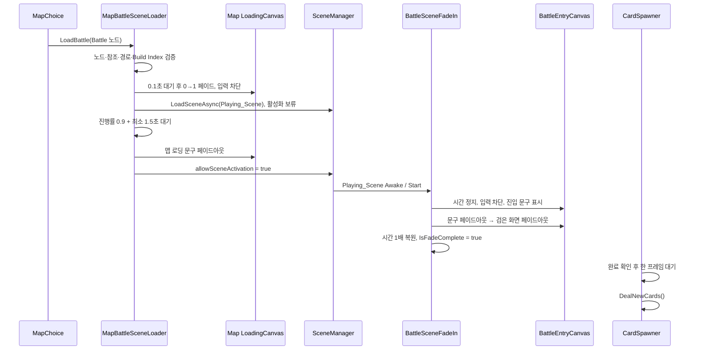
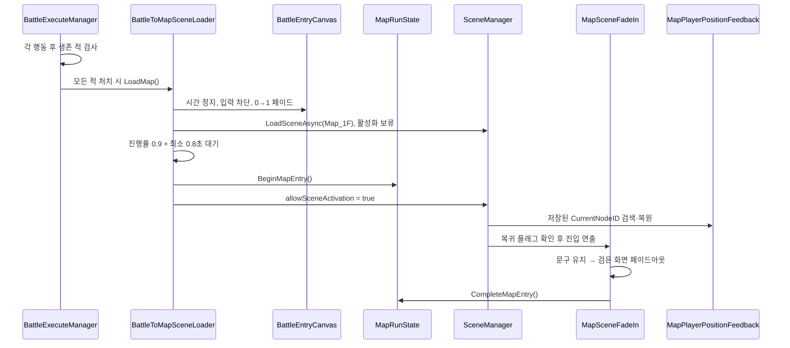

# 씬 전환 및 로딩

> [!implemented] 🟢 전환 기능 구현
> Battle 노드에서 전투로 들어가는 흐름과, 모든 적 처치 후 `Map_1F`로 돌아와 현재 노드를 복원하는 흐름까지 코드와 씬 참조가 연결되어 있다.

> [!partial] 🟡 로딩 이미지 부분 구현
> 현재 양쪽 배경은 Sprite가 없는 검은색 UI Image다. 최종 이미지 선정·연결과 화면 비율 검증이 남아 있다.

## 현재 구조

별도의 Loading 씬이나 `DontDestroyOnLoad` 오버레이를 사용하지 않는다. 출발 씬의 퇴장 오버레이와 도착 씬의 진입 오버레이가 화면을 이어받는다. 현재 노드 ID와 맵 복귀 여부만 정적 `MapRunState`가 씬 사이에서 유지한다.

### 전투 → 맵

## 씬별 역할과 직렬화 값

| 위치 | 요소 | 현재 값 | 상태 |
|---|---|---|---|
| `Map_1F` | 목적 씬 경로 | `Assets/Scenes/Playing_Scene.unity` | 🟢 유효 |
| `Map_1F` | 로드 모드 | `LoadSceneMode.Single` | 🟢 설정 |
| `Map_1F` | 퇴장 오버레이 | `LoadingCanvas` | 🟢 연결 |
| `Map_1F` | 페이드 시작 대기 / 암전 | 0.1초 / 0.35초 | 🟢 설정 |
| `Map_1F` | 최소 로딩 시간 / 문구 퇴장 | 1.5초 / 0.25초 | 🟢 설정 |
| `Map_1F` | 문구 | `작전 기록 압축 해제중...` + 점 1~3개 | 🟢 연결 |
| `Playing_Scene` | 진입 오버레이 | `BattleEntryCanvas` | 🟢 연결 |
| `Playing_Scene` | 진입 문구 | `PSR - 01` + 점 1~3개 | 🟢 연결 |
| `Playing_Scene` | 문구 진입 / 유지 / 퇴장 | 0.25초 / 1초 / 0.2초 | 🟢 설정 |
| `Playing_Scene` | 화면 퇴장 대기 / 페이드 | 0.1초 / 0.45초 | 🟢 설정 |
| `Playing_Scene` | 승리 후 목적 씬 | `Map_1F` / `LoadSceneMode.Single` | 🟢 유효 |
| `Playing_Scene` | 맵 복귀 문구 | `검사 완료됨. 재압축중` + 점 1~3개 | 🟢 연결 |
| `Playing_Scene` | 복귀 시작 대기 / 암전 / 최소 표시 | 0.3초 / 0.45초 / 0.8초 | 🟢 설정 |
| `Map_1F` | 복귀 진입 오버레이 | `MapEntryCanvas` | 🟢 연결 |
| `Map_1F` | 복귀 진입 문구 | `작전 기록 압축 해제 완료` + 점 1~3개 | 🟢 연결 |
| `Map_1F` | 진입 시작 대기 / 화면 페이드 / 최소 표시 | 0.1초 / 0.35초 / 1.5초 | 🟢 설정 |
| 양쪽 씬 | 배경 Image | Sprite 없음, 검은색 | 🟡 임시 연출 |
| 실행 환경 | 실제 플레이 검증 | Read Only 정책으로 미실시 | 🟡 확인 필요 |

## 맵 퇴장 단계

`MapBattleSceneLoader`는 다음 순서로 동작한다.

1. 중복 요청을 차단하고 대상이 실제 Battle 노드인지 확인한다.
2. `exitCanvasGroup`, 전투 씬 경로와 Build Index를 검증한다.
3. 오버레이의 Raycast를 활성화해 추가 입력을 막는다.
4. 실시간 기준으로 대기한 뒤 화면을 검게 페이드한다.
5. `LoadSceneAsync()`를 시작하고 `allowSceneActivation = false`로 둔다.
6. 로딩 진행률 0.9와 최소 표시 시간 1.5초를 모두 기다린다.
7. 맵 쪽 로딩 문구를 숨긴 뒤 전투 씬을 활성화한다.
8. 로드 생성 실패 시 검은 화면을 다시 투명하게 복원하고 입력 차단을 푼다.

## 전투 진입 단계

`BattleSceneFadeIn`은 전투 씬이 열린 직후 다음을 수행한다.

1. `Awake()`에서 `Time.timeScale`을 0으로 만들고 전체 오버레이의 입력 차단을 켠다.
2. 첫 프레임 후 `PSR - 01` 문구를 페이드인하고 1초 유지한다.
3. 문구를 숨긴 다음 검은 화면 전체를 페이드아웃한다.
4. 오버레이 GameObject를 비활성화하고 시간 배율을 1로 복원한다.
5. `IsFadeComplete`를 `true`로 설정한다.
6. `CardSpawner`가 이를 기다린 뒤 한 프레임 후 첫 카드 6장을 배분한다.

## 승리 후 맵 복귀 단계

1. `BattleExecuteManager`가 각 행동 직후 생존한 모든 `Enemy`를 검사한다.
2. 생존 적이 없으면 일반 라운드 정리를 중단하고 `BattleToMapSceneLoader.LoadMap()`을 호출한다.
3. 전투 오버레이가 입력을 차단하고 화면을 검게 만든 뒤 `Map_1F`을 비동기로 로드한다.
4. 씬 활성화 직전에 `MapRunState.BeginMapEntry()`로 맵 복귀 중임을 표시한다.
5. `MapPlayerPositionFeedback.Start()`가 저장된 노드 ID와 일치하는 `MapNode`를 찾아 현재 위치로 사용한다.
6. `MapSceneFadeIn`이 복귀 플래그가 있을 때만 문구와 화면 페이드를 실행하고, 완료 시 플래그를 해제한다.

현재 위치 보존은 `static` 메모리 값이므로 애플리케이션 종료, 스크립트 도메인 초기화, 세이브 로드까지 보장하는 저장 기능은 아니다.

## 남은 작업

- 맵과 전투 양쪽의 최종 로딩 이미지 Asset 선정 및 Sprite 연결
- 이미지 종횡비, 다양한 해상도와 Canvas Scaler 결과 확인
- Unity 실제 실행으로 경계 프레임, 입력 차단, 카드 등장 시점 확인
- 전환 실패를 플레이어에게 알리는 오류·재시도 UI
- 양방향 전환과 현재 노드 복원의 Unity 실제 플레이 검증
- 패배 시 처리와 맵 복귀 정책
- 현재 노드 외 전투 결과·완료 노드 상태의 런 컨텍스트
- 디스크 기반 저장·불러오기
- `Title`에서 `Map_1F`로 진입하는 흐름
- 필요 시 전투 진입 전 시간 배율을 저장하고 원래 값으로 복원
