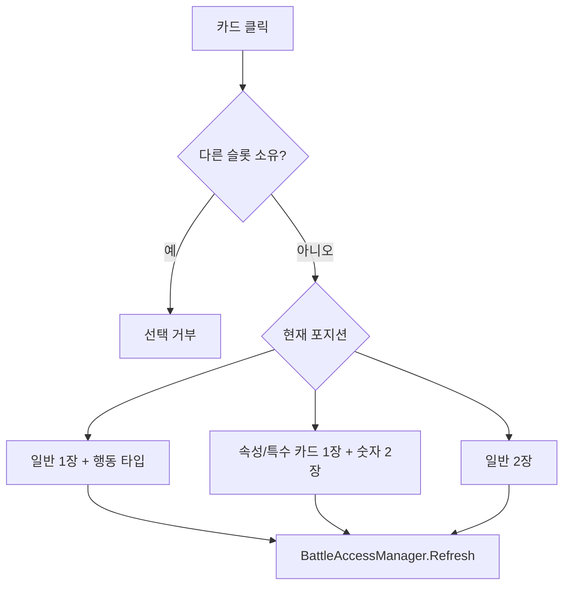

# 카드 시스템

> [!implemented] 🟢 구현
> 카드 생성, 포지션별 선택, 중복 소유 방지와 라운드 교체가 연결되어 있다.

## 카드 공급

`Playing_Scene`의 `CardSpawner` 직렬화 설정은 한 묶음에 **총 6장**을 배분한다. 일반 카드는 `1~10`의 무작위 숫자를 가진다.

특수 카드는 항상 포함되는 카드가 아니다. 6개 자리마다 `1~100` 난수에 대해 `1~5` 범위인지 판정하고, 통과한 자리가 하나 이상이면 그 후보 중 하나만 특수 카드가 된다. 따라서 한 묶음의 특수 카드는 0장 또는 1장이며, 현재 표시 문자열은 `T`다. 각 자리 판정이 독립적인 5%이므로 묶음에 특수 카드가 한 장 포함될 확률은 약 26.5%다.

> [!note] 용어 규칙
> **특수 카드**, **T**, **JK**, **조커**는 모두 같은 카드를 지칭한다. 문맥과 UI 표기에 따라 서로 바꾸어 사용할 수 있다.

카드 수는 코드 기본값 `10`보다 씬 값 `6`을 우선한다. 특수 카드 문구는 JSON `ui.card.special`·`ui.card.special_face` 키에서 조회하며 현재 둘 다 `T`다. 일반 라운드에서는 카드를 모아 아래로 떨어뜨린 후 기존 카드를 파괴하고 새 묶음을 배분한다. 승리·패배 종료 분기에서는 새 카드 배분 없이 결과 화면과 맵 복귀로 진행한다.

## 공통 선택 규칙

- 카드는 한 번에 하나의 `CardSelectionManagerBase`에만 소속될 수 있다.
- 같은 카드를 다시 누르면 해당 슬롯에서 해제된다.
- 카드 객체가 소유 매니저를 기억해 다른 포지션의 중복 사용을 막는다.
- 호버와 선택 높이 이동은 `Card`의 시각 애니메이션으로 처리한다.

## Front

- 일반 카드 1장만 사용하며 조커는 선택할 수 없다.
- 행동 타입을 별도로 공격 또는 방어로 선택한다.
- 공격 보너스: `선택 숫자 × 100`
- 방어력 및 마법 저항 보너스: 각각 `선택 숫자 × 5`

## Middle

선택 슬롯은 `속성/특수 카드 1장 + 숫자 카드 2장`이다.

일반 속성 카드는 숫자를 5로 나눈 반복 패턴으로 해석한다.

| 카드 숫자 | 속성 |
|---|---|
| 1, 6 | ARTS |
| 2, 7 | BURN |
| 3, 8 | CORROSION |
| 4, 9 | NECROSIS |
| 5, 10 | NERVOUS |

물리 모드에서는 속성 표시 대신 물리 표시를 사용한다. 마법 모드에서는 선택 속성 또는 특수 카드를 표시한다.

### 현재 공격 공식

| 입력 | Formula | 결과 |
|---|---:|---|
| 물리 | Formula1 | `(두 숫자의 합) × 100` |
| ARTS | Formula2 | `(두 숫자의 합) × 80` |
| BURN | Formula3 | `(두 숫자의 합) × 80` |
| NERVOUS | Formula4 | `(두 숫자의 합) × 80` |
| NECROSIS | Formula5 | `(두 숫자의 합) × 80` |
| CORROSION | Formula6 | `(두 숫자의 합) × 80` |
| 특수 카드 | Formula7 | `(두 숫자의 합) × 80` |

공식 선택은 씬의 `AttackCalculator` 직렬화 값과 일치한다. 현재 속성별 계산식은 이름만 나뉘고 수치 결과는 동일하다.

## Back

- 일반 카드 2장을 선택하면 승인이 완료된다.
- 현재 두 카드의 숫자는 저장되지만 회복 계산에는 사용되지 않는다.
- 실제 회복량은 `BattleExecuteManager.backHealAmount`의 고정값 50이다.

## 승인 그래프

