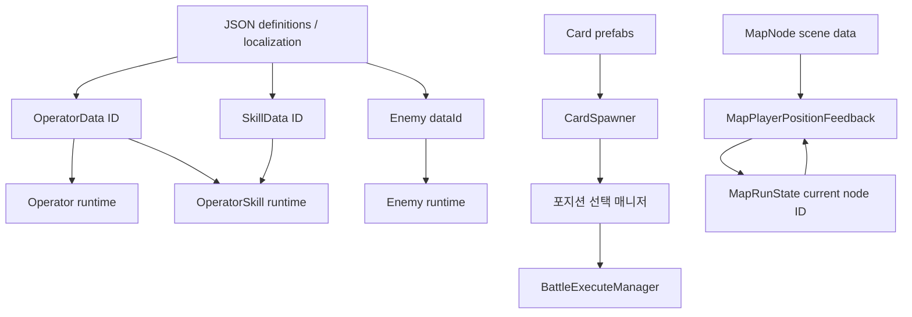

# 현재 데이터 카탈로그

문구·기본 스탯의 현재 기준은 `Assets/Resources/GameData`의 JSON이다. Unity ScriptableObject·씬·프리팹은 정의 ID와 문구 키, Unity 객체 참조를 유지한다. [[02 데이터/JSON 데이터 관리|JSON 데이터 관리]]를 함께 읽는다.

## 대원

| Asset | 포지션 | 클래스 | 적 타깃 | HP | ATK | DEF | RES | 속도 | 스킬 연결 |
|---|---|---|---:|---:|---:|---:|---:|---:|---|
| [[캐릭터/아군/사리아\|Saria_Data]] | Front | Defender | 필요 | 3150 | 485 | 595 | 10 | 20 | 없음 |
| [[캐릭터/아군/도로시 프랭크스\|Dorothy]] | Middle | Caster | 필요 | 1502 | 581 | 172 | 0 | 30 | 없음 |
| [[캐릭터/아군/조이스 무어\|Ptilopsis]] | Back | Healer | 불필요 | 1610 | 335 | 150 | 0 | 10 | 없음 |

현재 `Playing_Scene`에는 `Operator` 컴포넌트가 3개 존재해 세 포지션 구성과 일치한다.

## 스킬 데이터

| Asset | 이름/설명 | Max SP | 충전 | 충전량 | 대원 연결 |
|---|---|---:|---|---:|---|
| [[캐릭터/스킬/Dorothy Skill 1\|Dorothy_Skill_1]] | 비어 있음 | 2 | Natural | 1 | 없음 |

## 적

- 프리팹: `Enemy_MakeShift.prefab`
- 프리팹의 정의 ID: `makeshift`
- `Definitions/enemies.json` 현재 값: HP 1000, 공격 2000, 방어 10, 아츠 저항 15, 공격 속도 1.0
- 스폰 위치: FrontLeft, FrontRight, BackLeft, BackRight

위 수치는 최종 밸런스로 확정되지 않은 현재 JSON 값이다. 전투 HP는 인스턴스에서 관리하며 정의 JSON에는 저장하지 않는다.

## 카드

- 일반 카드 프리팹: `Card.prefab`
- 특수 카드 프리팹: `Card_Joker.prefab`
- `Playing_Scene` 배분량: 총 6장
- 일반 카드 숫자: 1~10 무작위
- 특수 카드 수: 묶음당 0~1장
- 특수 카드 표시: `T`
- 특수 카드 판정: 각 자리 5% 판정 후 통과 후보 중 최대 1장 선택

`특수 카드`, `T`, `JK`, `조커`는 같은 카드를 뜻한다.

현재 `acf7c46`의 `Cafe24PROSlimMax SDF`는 동적 Atlas 모드이며 글리프·문자 테이블이 존재한다. 이전 플래그의 빈 테이블 상태와 달라졌으나 실제 글자 표시·레이아웃은 미검증이다. 특수 카드 표기는 `ui.json`의 키로 조회한다.

> [!note] 코드 기본값과 씬 값
> `CardSpawner` 코드의 카드 수 기본값은 10장이지만 씬은 6장이다. 특수 카드 문구는 씬의 `ui.card.special`과 카드면의 `ui.card.special_face` 키로 조회하며 둘 다 현재 `T`다.

## 맵 노드

| ID | 층 | 타입 | 다음 노드 |
|---:|---:|---|---|
| 1 | 0 | Start | 2, 3, 4 |
| 2 | 1 | Event | 5, 6 |
| 3 | 1 | Event | 5, 7 |
| 4 | 1 | Event | 6, 7 |
| 5 | 2 | Battle | 8 |
| 6 | 2 | Battle | 8 |
| 7 | 2 | Battle | 8 |
| 8 | 3 | Shop | 없음 |

## 데이터 흐름

