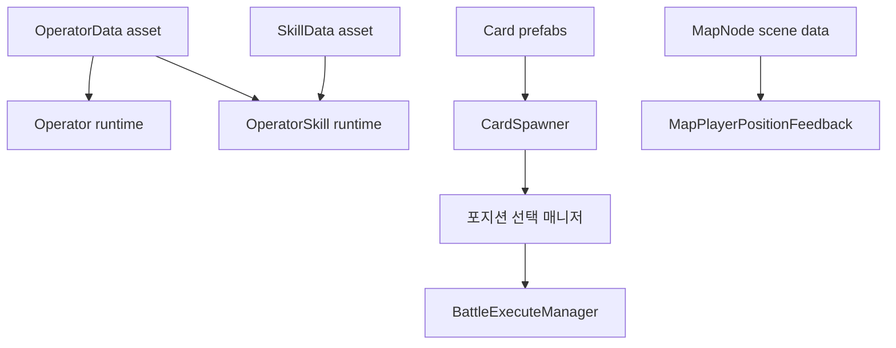

# 현재 데이터 카탈로그

## 대원

| Asset | 포지션 | 클래스 | 적 타깃 | HP | ATK | DEF | RES | 속도 | 스킬 연결 |
|---|---|---|---:|---:|---:|---:|---:|---:|---|
| [[캐릭터/아군/사리아|Saria_Data]] | Front | Defender | 필요 | 3150 | 485 | 595 | 10 | 20 | 없음 |
| [[캐릭터/아군/도로시 프랭크스|Dorothy]] | Middle | Caster | 필요 | 1502 | 581 | 172 | 0 | 30 | 없음 |
| [[캐릭터/아군/조이스 무어|Ptilopsis]] | Back | Healer | 불필요 | 1610 | 335 | 150 | 0 | 10 | 없음 |

현재 `Playing_Scene`에는 `Operator` 컴포넌트가 3개 존재해 세 포지션 구성과 일치한다.

## 스킬 데이터

| Asset | 이름/설명 | Max SP | 충전 | 충전량 | 대원 연결 |
|---|---|---:|---|---:|---|
| [[캐릭터/스킬/Dorothy Skill 1|Dorothy_Skill_1]] | 비어 있음 | 2 | Natural | 1 | 없음 |

## 적

- 프리팹: `Enemy_MakeShift.prefab`
- `Enemy_MakeShift.prefab` 직렬화 값: HP 2000, 공격 200, 방어 10, 마법 저항 15, 공격 속도 1.0
- 스폰 위치: FrontLeft, FrontRight, BackLeft, BackRight

## 카드

- 일반 카드 프리팹: `Card.prefab`
- 특수 카드 프리팹: `Card_Joker.prefab`
- `Playing_Scene` 배분량: 총 6장
- 일반 카드 숫자: 1~10 무작위
- 특수 카드 수: 묶음당 0~1장
- 특수 카드 표시: `T`
- 특수 카드 판정: 각 자리 5% 판정 후 통과 후보 중 최대 1장 선택

> [!note] 코드 기본값과 씬 값
> `CardSpawner` 코드의 필드 초기값은 10장과 `JK`지만, 현재 씬이 이를 6장과 `T`로 덮어쓴다. 이 카탈로그는 실제 직렬화된 씬 값을 기록한다.

## 맵 노드

| ID | 층 | 타입 | 다음 노드 |
|---:|---:|---|---|
| 1 | 0 | Start | 2, 3, 4 |
| 2 | 1 | Event | 5, 6 |
| 3 | 1 | Event | 5, 7 |
| 4 | 1 | Event | 6, 7 |
| 5 | 2 | Battle | 8 |
| 6 | 2 | Battle | 8 |
| 7 | 2 | Battle | 8 |
| 8 | 3 | Shop | 없음 |

## 데이터 흐름

