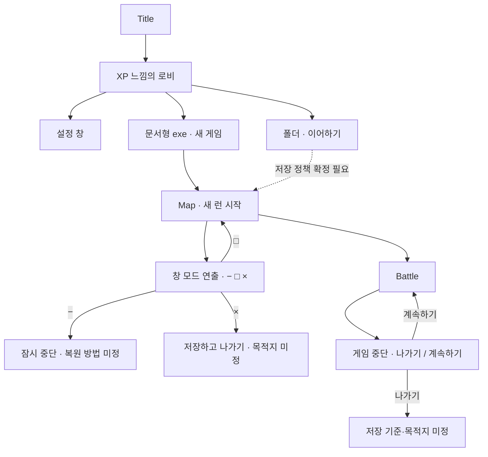

# 타이틀·로비 기획

## 기록 범위

2026-10-02 대화의 타이틀·로비·Map·Battle UI 아이디어를 파트별로 정리한다. **사용자가 제시한 요구**, **검토 제안**, **미결정 정책**을 구분한다. 이 문서는 기획 기록이며 구현 완료를 뜻하지 않는다.

현재 구현 상태는 [[00 프로젝트/구현 현황|구현 현황]]을 따른다. 기존 맵↔전투·결과 화면 흐름과 새 로비 복귀·일시정지 흐름은 별개이며, 이번 작업에서는 Unity 파일을 변경하지 않았다.

## 사용자가 제시한 방향

- 이 팬게임의 자체 설정: 강인공지능 PRTS의 배신 때문에 플레이어가 자신의 작전기록 전반에 문제가 있을 것으로 판단하고 내부 데이터에 직접 접근한다. 명일방주 원작의 공식 설정으로 기록하지 않는다.
- Title을 통해 로비에 들어간다.
- 로비는 Windows XP 느낌의 UI/UX를 사용한다.
- 초기 창에는 설정, 폴더 형태의 이어하기, 문서 형태의 새 게임 `.exe` 세 항목을 둔다.
- 초기 UI는 이미지 없이 TMP와 2D Square로 기능을 표시하고 추후 아이콘을 적용한다.
- Map과 Battle에도 우측 상단 조작 버튼을 둔다.
- Map은 창 모드 연출과 `− / □ / ×`, Battle은 일시정지 창의 `나가기 / 계속하기`를 사용한다.

## 파트별 문서

| 파트 | 기준 문서 | 다루는 내용 |
|---|---|---|
| 01 | [[04 기획/01 타이틀과 로비|타이틀과 로비]] | 세계관 진입, 초기 창, 설정·이어하기·새 게임 |
| 02 | [[04 기획/02 Map 창 모드|Map 창 모드]] | 우측 상단 버튼, 창 모드 연출, 최소화·확대·닫기 |
| 03 | [[04 기획/03 Battle 일시정지|Battle 일시정지]] | 중단 범위, 나가기·계속하기, 상태 복원 |
| 04 | [[04 기획/04 저장과 이어하기|저장과 이어하기]] | 저장 범위, 복귀 목적지, 런 초기화, 이어하기 정책 |

## 전체 흐름

## 공통 UI 원칙

- 이미지 자산 없이 TMP와 단색 사각형으로 초기 동작을 구성한다. 로비의 문서·폴더 모양은 후속 아이콘 단계의 방향으로 기록한다.
- Map/Battle 우측 상단 버튼은 2D Square와 TMP로 표시한다. 위치·크기·표시 문구의 정확한 값은 미정이다.
- Map의 전체 화면 복귀는 게임 내부 연출이다. 운영체제 창 모드나 해상도를 바꾸는 기능으로 확정하지 않는다.
- 새 UI의 게임 문구·메뉴 이름은 기존 [[02 데이터/JSON 데이터 관리|JSON 데이터 관리]] 방식과의 연결을 검토한다. 구체적인 키·파일·클래스는 미정이다.

## 다음 결정 순서

1. Map 최소화의 목적지·복원 방법과 `×`의 종료 범위를 정한다.
2. Battle 나가기의 목적지·저장 기준·재진입 지점을 정한다.
3. 새 게임 초기화와 저장·이어하기 범위를 정한다.
4. Title 진입 연출, 로비 배치, 버튼 문구와 설정 항목을 정한다.

진행 항목은 [[TODO LIST/기획 TODO LIST|기획 TODO LIST]]에서 관리한다. 후속 구현은 [[TODO LIST/코드 TODO LIST|코드 TODO LIST]]와 구분한다.
