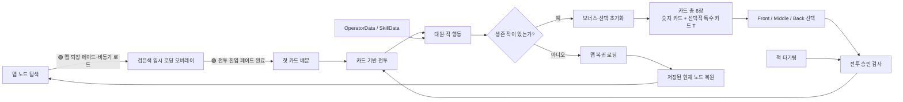

---
aliases:
  - RSR Wiki Home
tags:
  - project/randint-strategy-record
  - hub
status: active
updated: 2026-09-27
---

# 랜드인트 작전기록

> [!summary] 현재 상태
> **Randint Strategy Record**는 명일방주 세계관을 바탕으로 한 팬게임 프로토타입이다. 현재 작업 트리에는 카드 선택형 턴 전투, 3D 노드형 맵 탐색, Battle 노드 진입과 전투 승리 후 현재 노드로 돌아오는 왕복 흐름이 연결되어 있다. 실행 검증과 패배·영구 저장은 아직 남아 있다.

## 바로가기

- [[AI 주의사항|AI 주의사항 — 모든 AI와 협업자 필독]]
- [[00 프로젝트/프로젝트 개요|프로젝트 개요]]
- [[00 프로젝트/구현 현황|구현 현황]]
- [[00 프로젝트/상태 표기 규칙|상태 표기 규칙]]
- [[TODO LIST/TODO LIST|TODO LIST]]
- [[캐릭터/캐릭터 인덱스|캐릭터 인덱스]]
- [[01 시스템/전투 시스템|전투 시스템]]
- [[01 시스템/카드 시스템|카드 시스템]]
- [[01 시스템/대원·적·스킬|대원·적·스킬]]
- [[01 시스템/맵 시스템|맵 시스템]]
- [[01 시스템/씬 전환 및 로딩|씬 전환 및 로딩]]
- [[02 데이터/현재 데이터 카탈로그|현재 데이터 카탈로그]]
- [[03 개발 기록/씬과 코드 구조|씬과 코드 구조]]
- [[03 개발 기록/미구현·주의사항|미구현·주의사항]]
- [[로직트리/세부 로직트리.canvas|세부 로직트리 Canvas]]

## 시스템 관계



## 볼트 구조

```text
wiki/
├─ 랜드인트 작전기록 대문.md
├─ AI 주의사항.md
├─ 00 프로젝트/
│  ├─ 프로젝트 개요.md
│  ├─ 구현 현황.md
│  └─ 상태 표기 규칙.md
├─ 01 시스템/
│  ├─ 전투 시스템.md
│  ├─ 카드 시스템.md
│  ├─ 대원·적·스킬.md
│  ├─ 맵 시스템.md
│  └─ 씬 전환 및 로딩.md
├─ 02 데이터/
│  └─ 현재 데이터 카탈로그.md
├─ 03 개발 기록/
│  ├─ 씬과 코드 구조.md
│  └─ 미구현·주의사항.md
├─ TODO LIST/
│  └─ TODO LIST.md
├─ 캐릭터/
│  ├─ 적/
│  ├─ 아군/
│  ├─ 스킬/
│  └─ 직군/
└─ 로직트리/
   └─ 세부 로직트리.canvas
```

## 문서 원칙

- 모든 AI와 신규 협업자는 작업 전 [[AI 주의사항]]을 먼저 읽는다.
- 🟢 **구현**: 현재 씬과 코드에서 호출 경로가 확인된 기능
- 🟡 **부분 구현**: 데이터 또는 기반 클래스는 있으나 전체 플레이 흐름에 연결되지 않은 기능
- 🔴 **미구현**: 코드상 실제 결과를 만드는 처리가 없는 기능
- Unity 영역과 Wiki는 기본적으로 읽기 전용으로 다룬다. Wiki는 User가 명시적으로 갱신을 요청한 작업에서만 수정한다.
